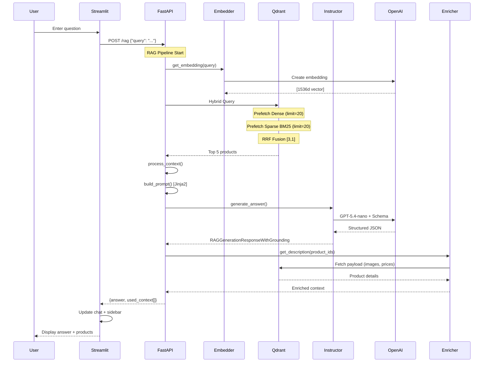
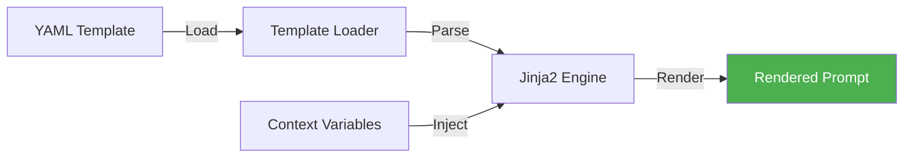
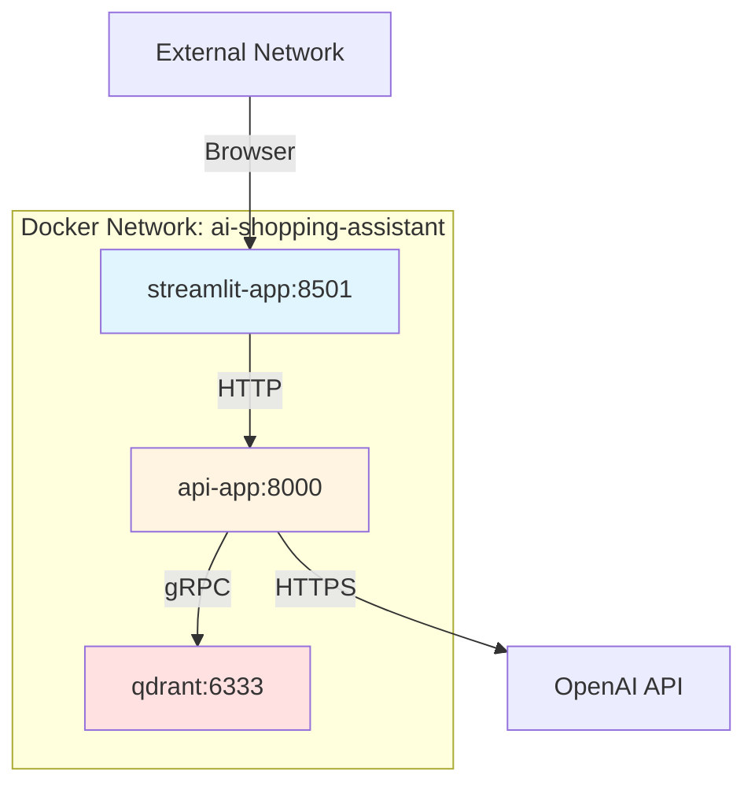

# Architecture Documentation

## Overview

The AI Shopping Assistant Lab is a production-grade RAG (Retrieval-Augmented Generation) system designed to answer product-related questions using hybrid search and structured LLM outputs. The system combines dense vector search, sparse keyword search, and LLM generation to provide accurate, grounded responses with product citations.

---

## System Architecture (Week 02)

```mermaid
graph TB
    subgraph "Client Layer"
        UI[Streamlit UI<br/>Port 8501]
    end
    
    subgraph "API Layer"
        API[FastAPI Service<br/>Port 8000]
        EP[/rag Endpoint]
        
        subgraph "RAG Pipeline"
            EMB[Embedding<br/>Generator]
            RET[Hybrid Retriever]
            PROC[Context Processor]
            PROMPT[Prompt Builder]
            GEN[LLM Generator]
            ENR[Context Enricher]
        end
    end
    
    subgraph "Data Layer"
        QDRANT[Qdrant Vector DB<br/>Port 6333]
        COLL[Amazon Collection<br/>Dense + Sparse Vectors]
    end
    
    subgraph "External Services"
        OPENAI[OpenAI API<br/>Embeddings + GPT]
        LS[LangSmith<br/>Tracing]
    end
    
    UI -->|POST /rag| API
    API --> EP
    EP --> EMB
    EMB -->|text-embedding-3-small| OPENAI
    EMB --> RET
    RET -->|Hybrid Query| QDRANT
    QDRANT --> COLL
    COLL -->|Top 5 Products| RET
    RET --> PROC
    PROC --> PROMPT
    PROMPT -->|Jinja2 Template| GEN
    GEN -->|Instructor + gpt-5.4-nano| OPENAI
    GEN --> ENR
    ENR -->|Fetch Details| QDRANT
    ENR -->|Answer + Context| API
    API -->|JSON Response| UI
    
    EMB -.->|Trace| LS
    RET -.->|Trace| LS
    GEN -.->|Trace| LS
    
    style UI fill:#e1f5ff
    style API fill:#fff4e1
    style QDRANT fill:#ffe1e1
    style OPENAI fill:#e1ffe1
```

---

## Component Architecture

### 1. **Streamlit UI** (`apps/chat_bot_ui`)

**Responsibilities:**
- User interaction and chat interface
- Message history management
- Product suggestion display (sidebar)
- API communication

**Key Features:**
- Session state for messages and context
- Product cards with images and prices
- Error handling with user-friendly popups
- Automatic UI refresh after queries

**Technology Stack:**
- Streamlit 1.x
- Python requests library
- Session state management

---

### 2. **FastAPI Backend** (`apps/api`)

**Responsibilities:**
- RESTful API endpoints
- RAG pipeline orchestration
- Request/response validation
- Error handling and logging

**Key Components:**

#### 2.1 **API Layer** (`api/api/`)
- `endpoints.py`: Route handlers
- `models.py`: Pydantic request/response models
- Request validation and response serialization

#### 2.2 **Agents Layer** (`api/agents/`)
- `retrieval_generation.py`: Core RAG logic
- `agents.py`: Multi-provider LLM runners
- `utils/prompt_management.py`: Template utilities

#### 2.3 **Core Layer** (`api/core/`)
- `config.py`: Environment configuration
- Settings management

---

### 3. **Qdrant Vector Database**

**Responsibilities:**
- Vector and sparse index storage
- Hybrid search execution
- Product metadata storage

**Collection Schema:**
```json
{
  "collection_name": "Amazon-shopping-collection-01-hybrid-search",
  "vectors": {
    "text-embedding-3-small": {
      "size": 1536,
      "distance": "Cosine"
    }
  },
  "sparse_vectors": {
    "bm25": {
      "index": {
        "type": "IDF"
      }
    }
  },
  "payload": {
    "parent_asin": "string",
    "preprocessed_description": "string",
    "average_rating": "float",
    "image": "string",
    "price": "float"
  }
}
```

---

## Data Flow Architecture

### RAG Pipeline Flow (Week 02)



---

## Hybrid Search Architecture

### Retrieval Strategy (RRF Fusion)

```mermaid
graph LR
    Q[User Query]
    
    subgraph "Dense Search Path"
        D1[Embedding<br/>text-embedding-3-small]
        D2[Vector Search<br/>Cosine Similarity]
        D3[Top 20 Results]
    end
    
    subgraph "Sparse Search Path"
        S1[Tokenization]
        S2[BM25 Index]
        S3[Top 20 Results]
    end
    
    subgraph "Fusion"
        RRF[Reciprocal Rank Fusion<br/>Weights: [3, 1]]
        FINAL[Top 5 Final Results]
    end
    
    Q --> D1
    Q --> S1
    
    D1 --> D2
    D2 --> D3
    
    S1 --> S2
    S2 --> S3
    
    D3 --> RRF
    S3 --> RRF
    
    RRF --> FINAL
    
    style RRF fill:#ffeb3b
    style FINAL fill:#4caf50,color:#fff
```

### RRF Formula

```
score(d) = Σ [ weight_i / (k + rank_i(d)) ]

where:
- d = document/product
- weight_i = search method weight [3 for dense, 1 for sparse]
- k = 60 (default RRF constant)
- rank_i(d) = rank of document d in search method i
```

**Benefits:**
- Combines semantic understanding (dense) with exact keyword matching (sparse)
- Mitigates weaknesses of individual methods
- Weighted fusion favors semantic search while preserving keyword precision

---

## Structured Output Architecture

### Instructor Integration

```mermaid
graph TB
    subgraph "Traditional Approach"
        T1[LLM API Call]
        T2[Raw Text Response]
        T3[String Parsing]
        T4[Manual Validation]
        T5[Error Prone]
    end
    
    subgraph "Instructor Approach (Week 02)"
        I1[Pydantic Schema]
        I2[Instructor Wrapper]
        I3[LLM + JSON Schema]
        I4[Validated Response]
        I5[Type Safe Objects]
    end
    
    I1 -->|Define| I2
    I2 -->|Inject Schema| I3
    I3 -->|Structured Output| I4
    I4 -->|Pydantic Model| I5
    
    T1 --> T2 --> T3 --> T4 --> T5
    
    style I5 fill:#4caf50,color:#fff
    style T5 fill:#f44336,color:#fff
```



### Schema Definition

```python
class RAGUsedContext(BaseModel):
    """Product reference used in answer generation."""
    id: str = Field(
        description="The id of the item used to answer the question"
    )
    description: str = Field(
        description="The description of the item used to answer the question"
    )

class RAGGenerationResponseWithGrounding(BaseModel):
    """LLM response with grounded product references."""
    answer: str = Field(
        description="The answer to the question"
    )
    references: list[RAGUsedContext] = Field(
        description="List of items used to answer the question"
    )
```

**Advantages:**
- ✅ Type safety at runtime
- ✅ Automatic validation
- ✅ Self-documenting schemas
- ✅ Retry logic for malformed outputs
- ✅ Integration with LLM function calling

---

## Prompt Management Architecture

### Template System

```
apps/api/src/api/agents/prompts/
└── retrieval_generation.yml
    ├── metadata
    │   ├── name
    │   ├── version
    │   ├── description
    │   └── author
    └── prompts
        └── retrieval_generation: |
            {{ context }}
            {{ query }}
```

### Rendering Flow



**Benefits:**
- Version control for prompts
- A/B testing capabilities
- Centralized prompt management
- Easy iteration without code changes
- Metadata tracking (author, version)

---

## Deployment Architecture

### Docker Compose Stack

```yaml
services:
  streamlit-app:
    - Port: 8501
    - Depends: api-app
    
  api-app:
    - Port: 8000
    - Depends: qdrant
    - Environment: OpenAI keys, LangSmith
    
  qdrant:
    - Port: 6333
    - Volume: ./qdrant_data
```

### Network Topology



---

## Observability Architecture

### LangSmith Tracing

```mermaid
graph TB
    subgraph "Application Layer"
        EMB[get_embedding]
        RET[retrieve_context]
        PROC[process_context]
        BUILD[build_prompt]
        GEN[generate_answer]
        PIPE[rag_pipeline]
    end
    
    subgraph "LangSmith Platform"
        TRACE[Trace Tree]
        META[Metadata]
        METRICS[Token Usage]
        EVAL[Evaluation]
    end
    
    EMB -.->|@traceable| TRACE
    RET -.->|@traceable| TRACE
    PROC -.->|@traceable| TRACE
    BUILD -.->|@traceable| TRACE
    GEN -.->|@traceable| TRACE
    PIPE -.->|@traceable| TRACE
    
    GEN -->|usage_metadata| METRICS
    
    TRACE --> EVAL
    META --> EVAL
    METRICS --> EVAL
    
    style TRACE fill:#9c27b0,color:#fff
```

### Traced Operations
- ✅ Embedding generation (model: text-embedding-3-small)
- ✅ Context retrieval (search type, results count)
- ✅ Context processing (formatting)
- ✅ Prompt building (template usage)
- ✅ LLM generation (model: gpt-5.4-nano, tokens)
- ✅ Full pipeline (end-to-end latency)

---

## Performance Characteristics

### Latency Budget

| Component | Target | P50 | P95 |
|-----------|--------|-----|-----|
| Embedding Generation | <100ms | 60ms | 120ms |
| Hybrid Search (Qdrant) | <50ms | 30ms | 80ms |
| Context Processing | <10ms | 5ms | 15ms |
| LLM Generation | <2s | 1.2s | 3s |
| Context Enrichment | <100ms | 50ms | 150ms |
| **Total Pipeline** | <3s | 1.5s | 4s |

### Scalability Considerations

**Current Bottlenecks:**
1. **LLM Generation** (70% of latency)
2. **Embedding Generation** (15% of latency)
3. **Context Enrichment** (10% of latency)

**Future Optimizations:**
- Embedding caching (Redis)
- Async LLM calls
- Batch processing for enrichment
- CDN for product images
- Response caching for common queries

---

## Security Architecture

### API Security
- ✅ Environment-based secrets management
- ✅ No hardcoded credentials
- ✅ HTTPS for external API calls
- ⚠️ Internal HTTP (Docker network isolation)

### Data Security
- Product data: Public Amazon reviews (no PII)
- User queries: Not persisted (session only)
- API keys: Environment variables only
- Qdrant: No authentication (internal network)

### Recommendations for Production
- [ ] Add API authentication (JWT)
- [ ] Enable Qdrant authentication
- [ ] Implement rate limiting
- [ ] Add HTTPS for all services
- [ ] Query sanitization and validation
- [ ] PII detection in user queries

---

## Technology Stack

### Backend
- **Python 3.13+**
- **FastAPI** - Modern async web framework
- **Pydantic** - Data validation
- **Instructor** - Structured LLM outputs

### AI/ML
- **OpenAI GPT-5.4-nano** - Text generation
- **OpenAI text-embedding-3-small** - Embeddings
- **Qdrant** - Vector database
- **LangSmith** - Observability

### Frontend
- **Streamlit** - Rapid UI development

### Infrastructure
- **Docker & Docker Compose** - Containerization
- **uv** - Python package management

---

## Design Decisions

### Why Hybrid Search?
- Dense vectors alone miss exact keyword matches
- Sparse search alone lacks semantic understanding
- RRF fusion provides best of both worlds
- 3:1 weighting favors semantic understanding while preserving precision

### Why Instructor?
- Type-safe LLM outputs eliminate parsing errors
- Automatic retry on validation failures
- Self-documenting API contracts
- Seamless integration with Pydantic ecosystem

### Why Jinja2 Templates?
- Separation of prompt engineering from code
- Version control for prompts
- Easy A/B testing without deployments
- Team collaboration on prompt iterations

### Why LangSmith?
- End-to-end observability
- Token usage tracking for cost management
- Debugging complex RAG pipelines
- Dataset management for evaluation

---

## Architecture Evolution

### Week 01 → Week 02 Changes

| Aspect | Week 01 | Week 02 |
|--------|---------|---------|
| **Search** | Dense-only | Hybrid (Dense + BM25) |
| **Output** | Unstructured text | Structured + References |
| **Prompts** | Hardcoded strings | Jinja2 templates |
| **Citations** | None | Product IDs + details |
| **UI** | Chat only | Chat + product cards |

---

## Future Architecture Considerations

### Planned Enhancements
- **Semantic Caching**: Redis layer for embeddings
- **Multi-modal Search**: Image + text queries
- **Personalization**: User preference vectors
- **Query Routing**: Intent classification → specialized pipelines
- **A/B Testing**: Traffic splitting for experimentation
- **Streaming Responses**: SSE for real-time answers

### Scalability Roadmap
- **Horizontal Scaling**: Kubernetes deployment
- **Load Balancing**: Multiple API instances
- **Qdrant Clustering**: Distributed vector search
- **CDN Integration**: Product image delivery
- **Message Queue**: Async processing for heavy queries
